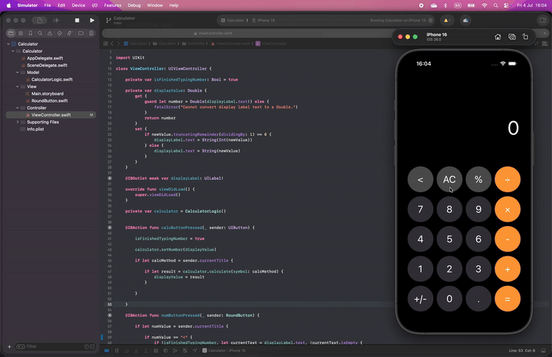

# Calculator (iOS Clone)

**Calculator** is a simple and functional replica of the native **iOS Calculator app**, built using **Swift** and **UIKit**. It includes all the essential operations such as addition, subtraction, multiplication, and division — with the same design and user flow you're familiar with on iPhone.

This project is part of my learning journey through the [iOS & Swift - The Complete iOS App Development Bootcamp] by **Angela Yu** on **Udemy**.

---

## Tech Stack

---

## Features

- Perform basic arithmetic operations: **+, −, ×, ÷**
- Use additional functions: **percent (%), toggle sign (+/−), all clear (AC)**
- Tap-based UI with real-time display updates
- Clean separation between logic and UI components

---

## Learning Purpose

This app was developed to strengthen my skills in:

- Applying the **MVC architecture** effectively
- Building intuitive interfaces with **UIKit**
- Writing **clean and scalable Swift code**
- Using **`private` access control** to encapsulate logic and improve modularity
- Creating **reusable and maintainable** functions
- Handling **user interactions** and performing **real-time calculations**

## Demo

